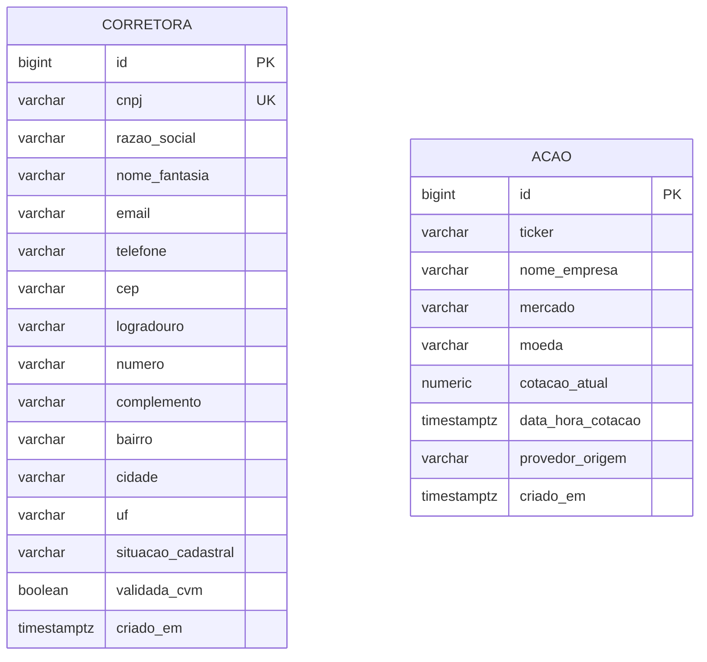
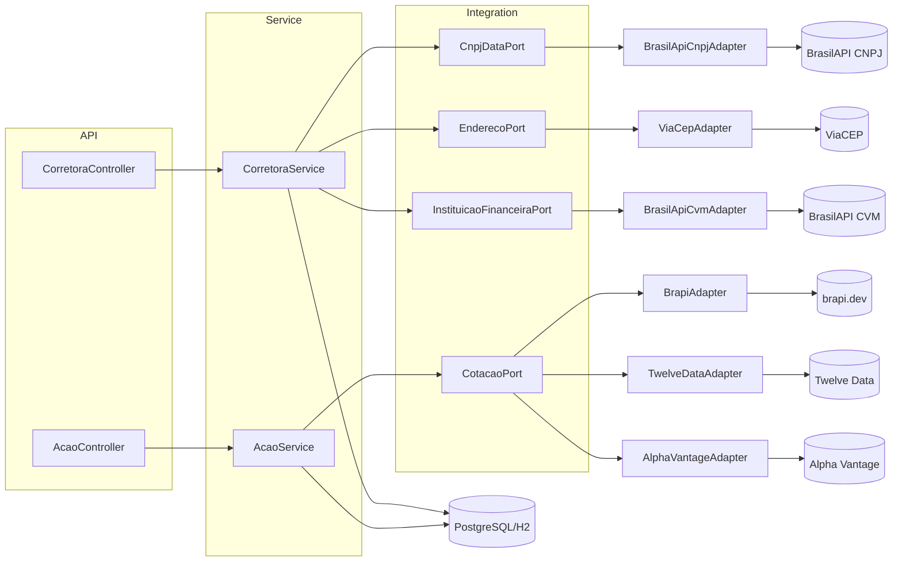

# Diagramas — Sistema de Gestão de Ações

## Diagrama de entidades (simplificado)

`Corretora` e `Acao` não têm relação direta no MVP (ver `proposal.md` — associação corretora/carteira/ação é diferencial futuro). Unicidade: `corretora.cnpj` é única; `(acao.ticker, acao.mercado)` é única em conjunto.

## Diagrama de componentes (portas e adaptadores)

Este é o mesmo diagrama de `openspec/changes/criar-sistema-gestao-acoes/design.md`, reproduzido aqui para consulta rápida sem precisar abrir os artefatos OpenSpec. Os fluxos de sequência (cadastro de corretora, cadastro/atualização de ação) estão detalhados em `design.md`.