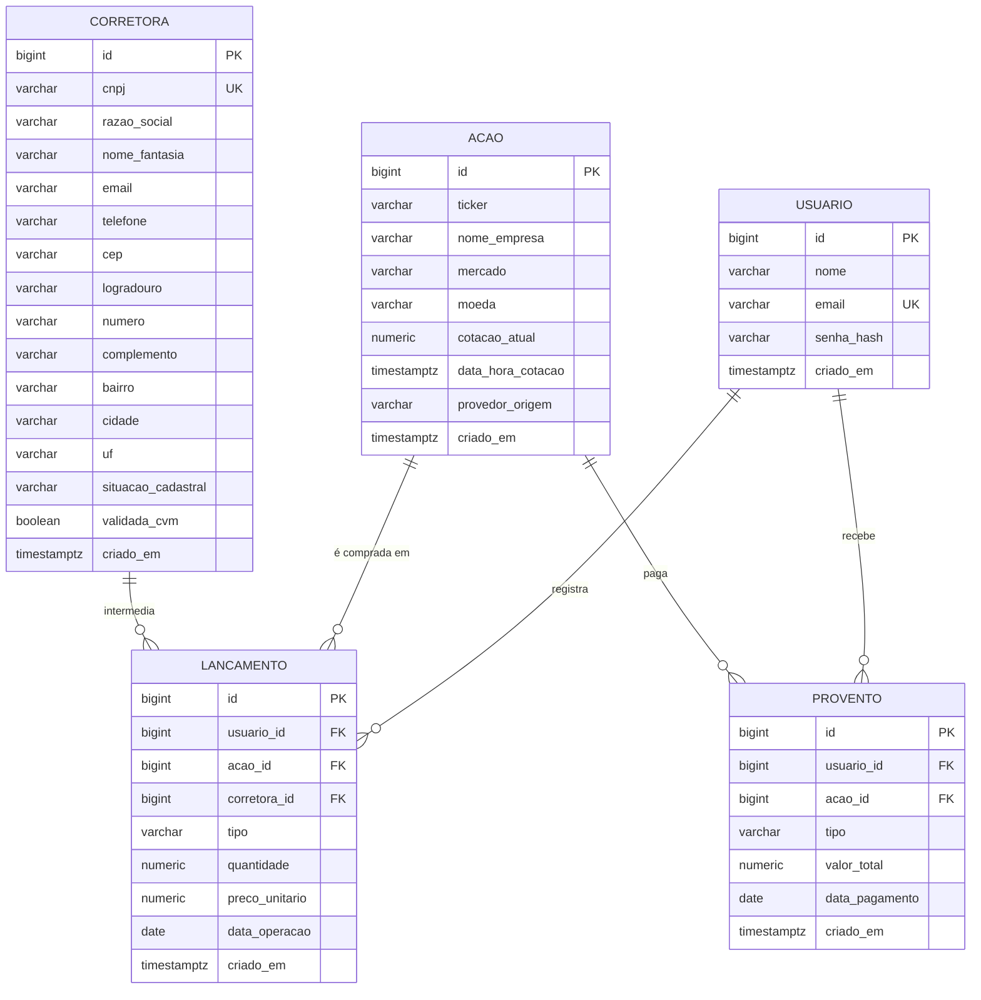
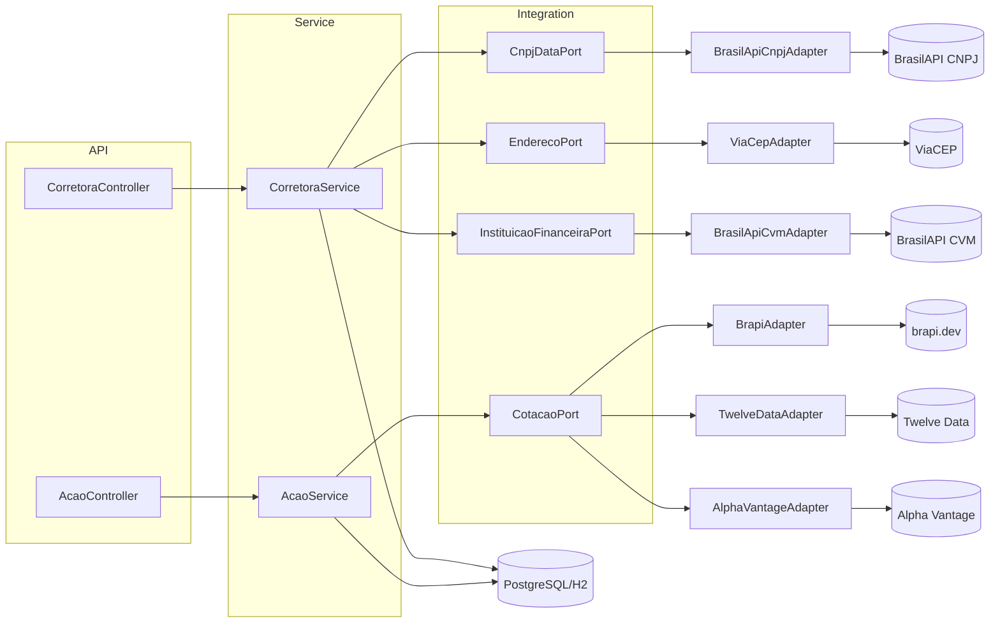
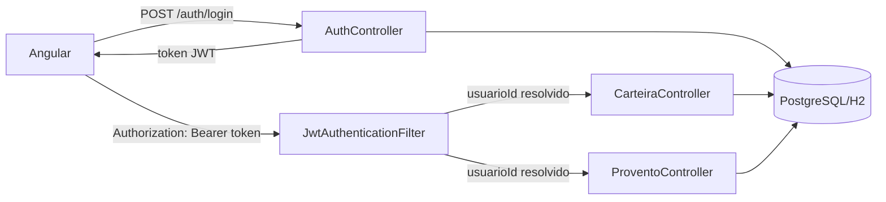

# Diagramas — Sistema de Gestão de Ações

## Diagrama de entidades (simplificado)

`Corretora` e `Acao` são catálogos globais, sem dono — `Lancamento` e `Provento` são os pontos onde `Usuario` se associa a elas (ver `openspec/changes/adicionar-carteira-auth-frontend-angular/design.md`). Unicidade: `corretora.cnpj` única; `acao.ticker` única globalmente (RN07 — não por mercado); `usuario.email` única. `Posicao` (quantidade/preço médio/valor atual por ativo) não é uma tabela: é calculada em runtime agregando os `Lancamento` de cada usuário.

## Diagrama de componentes (portas e adaptadores)

Este é o mesmo diagrama de `openspec/changes/criar-sistema-gestao-acoes/design.md`, reproduzido aqui para consulta rápida sem precisar abrir os artefatos OpenSpec. Os fluxos de sequência (cadastro de corretora, cadastro/atualização de ação) estão detalhados em `design.md`.

## Autenticação e carteira (frontend Angular)

`/corretoras` e `/acoes` continuam públicos e não passam pelo `JwtAuthenticationFilter` como exigência — o Angular os consome normalmente, com ou sem usuário logado. Detalhes em `openspec/changes/adicionar-carteira-auth-frontend-angular/design.md`.