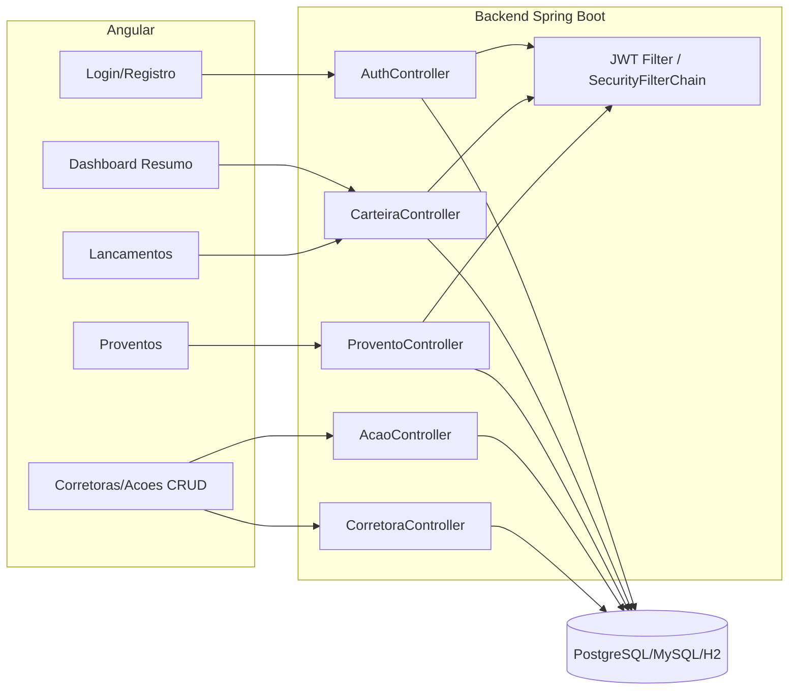
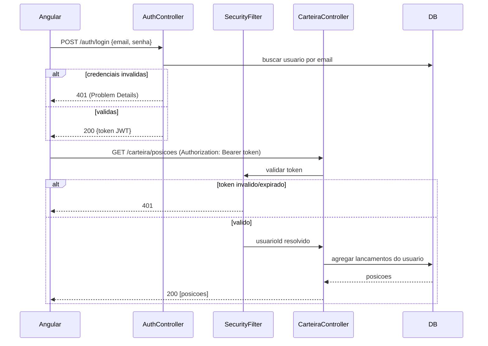

## Context

Ver `proposal.md` para motivação. Estado atual e restrições que moldam este design:

- Backend hoje é uma API REST pura, sem Spring Security, sem conceito de usuário — `Corretora` e `Acao` são catálogos globais (sem dono), consumidos livremente por qualquer cliente.
- Stack já fixada pelo change anterior (`criar-sistema-gestao-acoes`): Spring Boot 4.0.7 / Spring Framework 7 / Java 17, Hibernate ORM 7 (exige `@JdbcTypeCode(SqlTypes.VARCHAR)` em enums e `VARCHAR` em vez de `CHAR`), OpenFeign para integrações externas, Flyway por perfil (`db/migration/postgresql` para `dev`/`test`, `db/migration/mysql` para `mysql`), erro centralizado em Problem Details (RFC 9457) via `GlobalExceptionHandler`.
- 74 testes existentes não podem quebrar; contratos de `/corretoras` e `/acoes` (RF01–RF12) são avaliados pelo professor e não devem mudar.
- Nenhum frontend existe hoje; o grupo quer um app Angular novo, com login, inspirado visualmente na experiência de carteira do Investidor10 (dashboard, sidebar/abas, cards de resumo, tabela de posições).
- Prazo acadêmico: decisões priorizam simplicidade e previsibilidade sobre robustez de produção.

## Goals / Non-Goals

**Goals:**
- Definir a arquitetura de autenticação (stateless, JWT) e exatamente quais endpoints passam a exigir usuário autenticado, sem alterar o contrato de `/corretoras` e `/acoes`.
- Definir o modelo de dados de Carteira (lançamentos e posições) e Proventos, incluindo se posições são persistidas ou calculadas.
- Definir a arquitetura do frontend Angular: estrutura, roteamento, guards, consumo da API, biblioteca de gráficos, e como ele se relaciona com o backend em desenvolvimento (CORS, portas).
- Fixar decisões que as specs desta mudança já assumem como verdadeiras, para a implementação não decidir ad-hoc.

**Non-Goals:**
- Venda/baixa de posição, rebalanceamento, metas, IRPF automático, integração B3, rankings/comparador de ativos — fora do MVP desta mudança (mesmo racional de escopo do change anterior; ver seção 11 do enunciado, "diferenciais").
- Refresh token, OAuth2/login social, múltiplos papéis/admin — autenticação é login+senha simples com JWT de expiração curta; todo usuário autenticado tem acesso apenas aos próprios dados de carteira/proventos.
- Empacotar o build do Angular dentro do artefato Maven (ex. `frontend-maven-plugin` copiando para `static/`) — o frontend roda como projeto separado (`ng serve` em dev); empacotamento único fica registrado como possível evolução, não implementado aqui.
- Cobertura de testes E2E completa no Angular — mantém-se a suíte padrão gerada pelo Angular CLI (specs de componente/serviço), o esforço de teste automatizado continua concentrado no backend.

## Decisions

### Autenticação: Spring Security + JWT stateless

**Decisão**: `spring-boot-starter-security` + biblioteca `io.jsonwebtoken:jjwt` (api/impl/jackson). Login (`POST /auth/login`) e cadastro (`POST /auth/registrar`) emitem/validam um JWT assinado (HS256, segredo via `JWT_SECRET`, nunca hardcoded — segue o padrão já usado para chaves de provedor no `.env.example`). Sessão é stateless (`SessionCreationPolicy.STATELESS`); o Angular envia `Authorization: Bearer {token}` em cada requisição protegida via `HttpInterceptor`.

**Alternativa rejeitada**: sessão/cookie com Spring Security tradicional. Rejeitada porque quebraria a natureza stateless que a API já tem (nenhum estado de sessão hoje), exigiria tratamento de CSRF adicional para um SPA, e complicaria testes automatizados que hoje não lidam com cookies.

Senha armazenada com `BCryptPasswordEncoder` (força padrão). Erros de autenticação (`401`) e autorização (`403`) são traduzidos para o mesmo formato Problem Details já usado no resto da API, via `AuthenticationEntryPoint`/`AccessDeniedHandler` customizados — não o corpo padrão do Spring Security.

### Escopo de proteção: endpoints existentes continuam públicos

**Decisão**: `/corretoras/**`, `/acoes/**`, `/auth/**`, `/swagger-ui/**`, `/v3/api-docs/**`, `/h2-console/**` e `/actuator/**` permanecem `permitAll`. Somente os endpoints novos de Carteira (`/carteira/**`) e Proventos (`/proventos/**`) exigem JWT válido, resolvendo o usuário autenticado a partir do token (claim `sub` = id do usuário).

**Racional**: os RF01–RF12 (corretoras/ações) já estão implementados, testados (74 testes) e documentados na coleção Postman entregue — exigir login ali seria uma mudança de contrato não solicitada pelo enunciado original e quebraria material de avaliação já pronto. O login "protege" a experiência do usuário no Angular (ele não acessa o dashboard sem logar), mas não é um requisito de segurança do catálogo público de ações/corretoras em si.

**Alternativa rejeitada**: proteger tudo atrás de login. Rejeitada para não introduzir uma mudança de contrato (`Modified Capability`) em `gestao-acoes`/`gestao-corretoras`, que o `proposal.md` desta mudança deliberadamente evita.

### Modelo de dados de Carteira: lançamentos como fonte de verdade, posição calculada

**Decisão**: `Lancamento` é a única tabela persistida para movimentação (compra de uma ação, por um usuário, numa corretora, com quantidade/preço/data). A "posição consolidada" (quantidade total, preço médio ponderado, valor investido) é **calculada em runtime** por uma query agregada (`GROUP BY usuario_id, acao_id`), não persistida em tabela própria.

**Racional**: evita duplicar estado (lançamento + posição desnormalizada) e os bugs de sincronização que isso implicaria a cada novo lançamento; para o volume de dados de uma demonstração acadêmica, a agregação em runtime é performática o suficiente (índice em `(usuario_id, acao_id)` cobre a consulta). Valor atual e variação são obtidos combinando a posição calculada com `Acao.cotacaoAtual` (já existente), sem nova chamada a provedor externo.

**Alternativa rejeitada**: tabela `Posicao` persistida, atualizada a cada `POST /carteira/lancamentos`. Rejeitada pela complexidade extra de manter consistência (transação dupla, risco de drift) sem benefício real na escala do projeto.

**Escopo MVP**: apenas lançamentos de **compra/aporte** (sem venda/baixa) — consistente com a escolha do usuário nesta conversa. Campo `tipo` no modelo já existe como `COMPRA` fixo por enquanto, para não exigir migration adicional se venda for adicionada como diferencial futuro.

### Proventos: entidade própria, sem cálculo automático

**Decisão**: `Provento` é uma tabela própria (usuário, ação, tipo — `DIVIDENDO`/`JCP`, valor total recebido, data de pagamento), cadastrada manualmente pelo usuário via formulário — não há integração externa de proventos no MVP (nenhuma API gratuita confiável e simples foi adotada para isso; ver `Non-Goals`). Isso é consistente com a restrição do enunciado de "pelo menos três integrações externas reais", que já é cumprida pelas integrações existentes.

### Frontend: Angular standalone + Angular Material + ng2-charts

**Decisão**: projeto Angular novo em `frontend/` (fora do build Maven, `npm`/`ng` independente), usando **standalone components** (sem `NgModule`), roteamento com `provideRouter` e guards funcionais (`CanActivateFn`) para proteger rotas de carteira/proventos/dashboard. UI com **Angular Material** (acelera formulários, tabelas, cards dado o prazo) com um tema customizado (cores/sidebar) para aproximar visualmente do dashboard do Investidor10. Gráficos com **ng2-charts + Chart.js** (leve, MIT, integra fácil com Angular) para alocação por ativo (pizza/donut) e evolução de patrimônio (linha).

**Alternativa rejeitada**: CSS/HTML 100% customizado sem biblioteca de componentes. Rejeitada por custo de tempo maior sem ganho relevante para um trabalho acadêmico avaliado também pela funcionalidade.

Estrutura de pastas prevista:
```
frontend/
  src/app/
    core/          interceptors (JWT), guards, services base (AuthService)
    features/
      auth/        login, registro
      dashboard/   resumo da carteira
      lancamentos/ formulário + listagem
      proventos/   formulário + listagem
      corretoras/  CRUD
      acoes/       CRUD
    shared/        componentes reutilizáveis (cards, tabelas)
  angular.json, package.json
```

`environment.ts` aponta `apiUrl` para `http://localhost:8080` em dev.

### CORS

**Decisão**: `CorsConfigurationSource` no backend liberando `http://localhost:4200` (origem do `ng serve`) para os métodos usados, com `Authorization` na lista de headers permitidos. Configurável via `APP_CORS_ALLOWED_ORIGINS` (env var, segue o padrão de configuração externa já usado no projeto).

### Migrations

**Decisão**: novas migrations continuam a numeração existente por perfil: `db/migration/postgresql/V4__create_usuario.sql`, `V5__create_lancamento.sql`, `V6__create_provento.sql`; equivalentes em `db/migration/mysql/V3__create_usuario.sql`, `V4__create_lancamento.sql`, `V5__create_provento.sql` (sintaxe própria, como já ocorre com `V1`/`V2` desse perfil).

**Nota (2026-08-18): migrado de Flyway para Liquibase.** Essas migrations Flyway (V4-V6/V3-V5) foram posteriormente convertidas para changesets Liquibase (`db/changelog/changes/003-create-usuario.xml`, `004-create-lancamento.xml`, `005-create-provento.xml`), com a mesma estrutura de tabelas — ver a nota equivalente em `openspec/changes/criar-sistema-gestao-acoes/design.md` e o `README.md` para o estado atual.

## Diagrama de componentes (Mermaid)



## Fluxo: login e acesso a rota protegida



## Modelo de dados (novas tabelas)

```sql
CREATE TABLE usuario (
  id BIGSERIAL PRIMARY KEY,
  nome VARCHAR(150) NOT NULL,
  email VARCHAR(255) NOT NULL,
  senha_hash VARCHAR(255) NOT NULL,
  criado_em TIMESTAMP WITH TIME ZONE NOT NULL,
  CONSTRAINT uk_usuario_email UNIQUE (email)
);

CREATE TABLE lancamento (
  id BIGSERIAL PRIMARY KEY,
  usuario_id BIGINT NOT NULL REFERENCES usuario(id),
  acao_id BIGINT NOT NULL REFERENCES acao(id),
  corretora_id BIGINT NOT NULL REFERENCES corretora(id),
  tipo VARCHAR(10) NOT NULL DEFAULT 'COMPRA',
  quantidade NUMERIC(19,8) NOT NULL,
  preco_unitario NUMERIC(19,4) NOT NULL,
  data_operacao DATE NOT NULL,
  criado_em TIMESTAMP WITH TIME ZONE NOT NULL
);
CREATE INDEX ix_lancamento_usuario_acao ON lancamento (usuario_id, acao_id);

CREATE TABLE provento (
  id BIGSERIAL PRIMARY KEY,
  usuario_id BIGINT NOT NULL REFERENCES usuario(id),
  acao_id BIGINT NOT NULL REFERENCES acao(id),
  tipo VARCHAR(15) NOT NULL,
  valor_total NUMERIC(19,4) NOT NULL,
  data_pagamento DATE NOT NULL,
  criado_em TIMESTAMP WITH TIME ZONE NOT NULL
);
CREATE INDEX ix_provento_usuario_acao ON provento (usuario_id, acao_id);
```

`quantidade` usa `NUMERIC(19,8)` (não inteiro) para admitir frações de ação (ex. planos de recompra/BDRs fracionários), consistente com a flexibilidade já dada a `cotacaoAtual`.

## Risks / Trade-offs

- **[Risco] Configuração incorreta do `SecurityFilterChain` pode bloquear acidentalmente Swagger, H2 console ou os endpoints existentes** → Mitigação: lista explícita de `permitAll` cobrindo cada path já usado hoje, com teste de integração garantindo `GET /acoes` sem token continua `200`.
- **[Risco] Posição calculada via agregação em runtime pode ficar lenta se a carteira crescer muito** → aceito para escala acadêmica; índice `(usuario_id, acao_id)` mitiga; documentar como limitação conhecida.
- **[Trade-off] JWT sem refresh token expira e obriga novo login durante a demonstração** → aceitável; expiração configurável via `APP_JWT_EXPIRATION_MINUTES` com valor generoso para a apresentação (ex. 120 min).
- **[Risco] Rodar backend e frontend como dois processos separados na apresentação** → Mitigação: documentar claramente no README os dois comandos (`./mvnw spring-boot:run` e `npm start` em `frontend/`) e a URL de cada um.
- **[Trade-off] Angular Material adiciona dependência e peso ao bundle** → aceito em troca de velocidade de desenvolvimento dado o prazo do trabalho.
- **[Risco] Escopo "compras apenas" (sem venda) pode não representar fielmente uma carteira real (posição nunca diminui)** → aceito como limitação documentada do MVP, coerente com a decisão explícita desta conversa; venda registrada como diferencial futuro.

## Migration Plan

Não há dados em produção. Passos:
1. Aplicar as novas migrations Flyway (`usuario`, `lancamento`, `provento`) nos três perfis ao subir a aplicação.
2. Rodar `npm install` e `ng serve` em `frontend/` para o ambiente de desenvolvimento; nenhuma etapa de build de produção é exigida neste MVP.
3. Rollback: reverter o commit desta mudança; nenhuma migration destrutiva é aplicada sobre tabelas existentes (`corretora`, `acao` não são alteradas).

## Estratégia de testes

- Backend: testes unitários para `AuthService` (hash/verificação de senha, geração/validação de JWT), `CarteiraService` (agregação de posições, incluindo casos com múltiplos lançamentos e múltiplas ações), `ProventoService`; `@WebMvcTest` para os novos controllers (incluindo cenário sem token → 401, token inválido → 401); `@DataJpaTest` para `LancamentoRepository`/`ProventoRepository`/`UsuarioRepository` (constraint de email único); teste de integração garantindo que `/acoes` e `/corretoras` continuam acessíveis sem autenticação após introduzir Spring Security.
- Frontend: specs padrão do Angular CLI para `AuthService` (armazenamento/anexação do token) e para o guard de rota; sem exigência de cobertura ampla de componentes visuais.