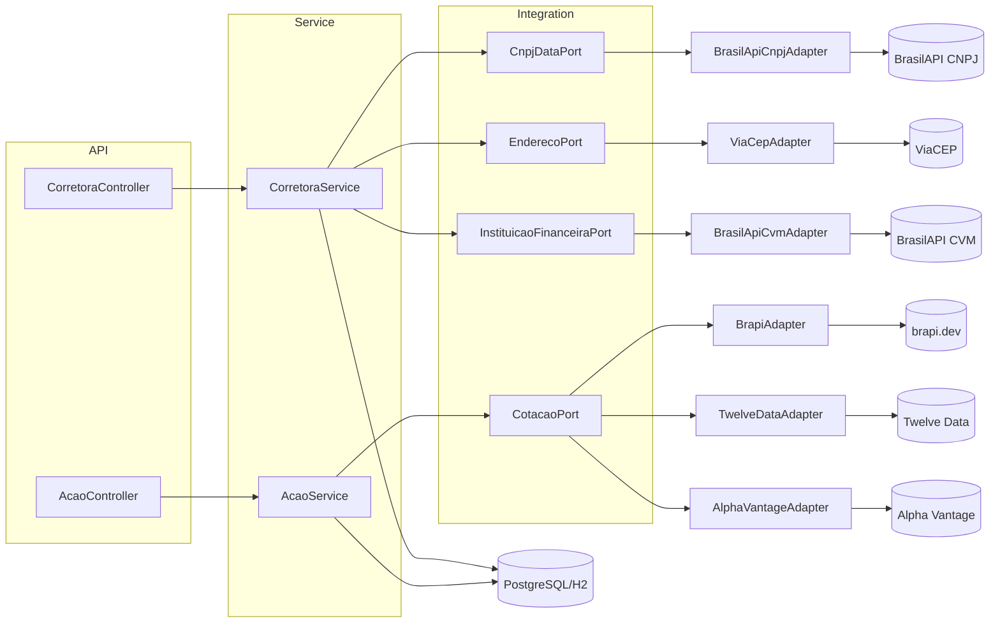
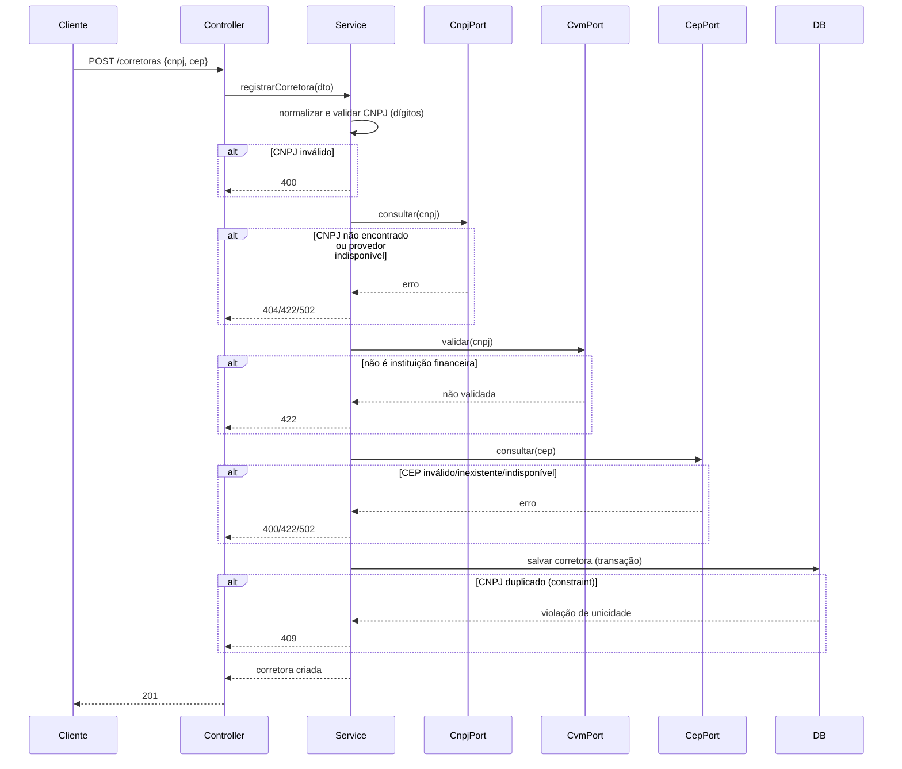
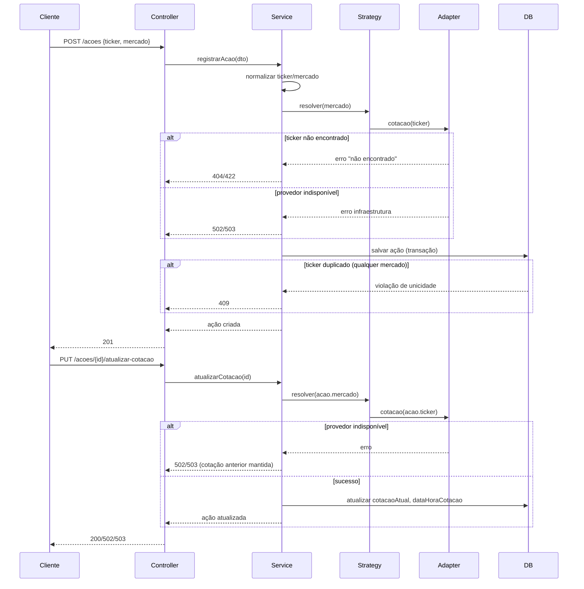

## Context

Projeto acadêmico novo (sem código de domínio existente — apenas o esqueleto gerado pelo Spring Initializr). Ver `proposal.md` para motivação. Restrições que moldam este design:

- Desenvolvimento no IntelliJ IDEA, Java 17 (Eclipse Temurin), Maven, Spring Boot.
- Cinco integrações externas reais (BrasilAPI ×2, ViaCEP, brapi.dev, Twelve Data/Alpha Vantage), cada uma com contrato, autenticação e limites próprios, que devem ficar isoladas do domínio.
- Ambiente de avaliação acadêmica: suíte de testes não pode depender de rede real nem de cotas pagas.
- Referência arquitetural apenas estrutural: `https://github.com/jeffersonarpasserini/suporteos2025` (camadas em pacotes), sem herdar regras de negócio.

## Goals / Non-Goals

**Goals:**
- Definir a arquitetura em camadas e o padrão Ports and Adapters/Strategy para as 5 integrações externas.
- Fixar decisões técnicas que os specs já assumem como verdadeiras (unicidade de ticker, política de instituição não validada, precisão monetária, timezone) para que a implementação não precise decidir isso ad-hoc.
- Especificar o modelo de dados, constraints e o contrato REST completo, com códigos HTTP por cenário de erro.
- Especificar os contratos dos 5 adaptadores externos com o suficiente para implementar sem inventar payloads.

**Non-Goals:**
- Implementar autenticação/autorização (Spring Security é diferencial, fora do MVP).
- Implementar histórico de cotações, entidade `Carteira`, cache avançado, circuit breaker ou fallback automático entre provedores US (todos diferenciais futuros, ver `proposal.md`).
- Otimizar performance além do necessário para um MVP acadêmico.

## Decisões confirmadas pelo usuário (2026-08-12)

As 8 perguntas da seção 17 do prompt mestre alteravam comportamento externamente observável ou escopo. Todas foram confirmadas pelo usuário em 2026-08-12, incluindo a fonte de validação CVM (pergunta 5): usar a BrasilAPI mesmo, sem exigir outra fonte oficial.

**Revisão em 2026-08-12 (posterior):** o usuário forneceu o enunciado original do trabalho acadêmico. Duas decisões desta tabela foram corrigidas para bater com o texto literal do enunciado, substituindo a recomendação inicial (que havia sido feita sem acesso a esse documento):
- **Pergunta 2**: o enunciado (RN07) diz "Não será permitido cadastrar duas ações com o mesmo ticker" — sem menção a mercado. Corrigido de `(ticker, mercado)` para **ticker global**.
- **Pergunta 3**: o enunciado (seção 6, não funcionais) lista "O banco de dados deverá ser H2, MySQL e PostgreSQL" como os três obrigatórios, não como opção. Corrigido de "MySQL opcional" para **MySQL obrigatório**.

| # | Pergunta | Decisão confirmada |
|---|---|---|
| 1 | Instituição não validada na CVM: rejeitar ou salvar como `NAO_VALIDADA`? | **Rejeitar** (RN03, `422`) — `gestao-corretoras`, `validacao-instituicao-financeira` |
| 2 | Unicidade de ação: ticker global ou `(ticker, mercado)`? | **Ticker global** (RN07 do enunciado) — `gestao-acoes`. *Revisado em 2026-08-12; ver nota acima.* |
| 3 | Banco principal: PostgreSQL + H2 para testes, MySQL opcional? | **H2, MySQL e PostgreSQL, todos obrigatórios** (seção 6 do enunciado) — ver "Bancos e perfis" abaixo. *Revisado em 2026-08-12; ver nota acima.* |
| 4 | Twelve Data como provedor US padrão, Alpha Vantage como alternativa configurável? | **Sim** — `app.market-data.us-provider=twelve-data` por padrão |
| 5 | Recurso de corretoras/CVM da BrasilAPI atende à validação exigida? | **Confirmado: usar a BrasilAPI** como única fonte de validação CVM no MVP |
| 6 | Número, complemento, email, telefone: editáveis pelo usuário? | **Sim para `numero` e `complemento`** (a ViaCEP não os fornece); `email`/`telefone` vêm da BrasilAPI quando disponíveis, e podem ser complementados manualmente como opcionais (não bloqueiam validação) |
| 7 | Paginação entra no MVP? | **Sim** — já refletido em `gestao-corretoras` e `gestao-acoes` |
| 8 | Relação corretora/carteira/ação fora do MVP? | **Sim, fora do MVP** |

## Decisions

### Arquitetura em camadas + Ports and Adapters

Pacotes: `br.com.gestaoacoes.{controller, service, repository, model, dto, mapper, exception, config, integration}`.

`integration` contém, por capacidade, uma porta (interface Java) e um adaptador por provedor:

```
integration/
  cnpj/          CnpjDataPort, BrasilApiCnpjAdapter
  cep/           EnderecoPort, ViaCepAdapter
  instituicao/   InstituicaoFinanceiraPort, BrasilApiCvmAdapter
  cotacao/       CotacaoPort, BrapiAdapter, TwelveDataAdapter, AlphaVantageAdapter,
                 CotacaoStrategyResolver (seleciona adaptador por Mercado)
```

DTOs de resposta de cada provedor ficam confinados ao respectivo adaptador; a conversão para o modelo interno acontece dentro do adaptador, nunca no service.

**Alternativa rejeitada**: um único `HttpClient` genérico compartilhado entre provedores. Rejeitada porque cada provedor tem contrato, autenticação e tratamento de erro distintos; um cliente genérico vazaria detalhes de um provedor para os outros.

### Feign vs WebClient

**Decisão: OpenFeign** para os 5 adaptadores. Justificativa: interfaces declarativas reduzem boilerplate para APIs REST simples e síncronas (nenhuma integração aqui exige streaming ou reatividade); `spring-cloud-starter-openfeign` integra-se bem com `ErrorDecoder` para mapear `404`/`429`/`5xx` por provedor, e com timeouts via `feign.client.config`. WebClient seria preferível se houvesse necessidade de composição reativa, o que não é o caso.

**Alternativa rejeitada**: WebClient síncrono (`.block()`). Rejeitada por adicionar complexidade reativa sem benefício, já que a aplicação inteira é bloqueante (Spring Web MVC).

### Bancos e perfis

- Perfil `test`: H2 em memória (`MODE=PostgreSQL`), para testes automatizados. Migrations em `db/migration/postgresql` (H2 nesse modo é compatível com a sintaxe usada).
- Perfil `dev`/`default`: PostgreSQL local, banco persistente principal. Migrations em `db/migration/postgresql`.
- Perfil `mysql`: **obrigatório pelo enunciado** (seção 6: "H2, MySQL e PostgreSQL"). Migrations próprias em `db/migration/mysql` (sintaxe MySQL não é totalmente compatível com PostgreSQL — ver nota de implementação abaixo).
- `ddl-auto=validate` em todos os perfis; `create-drop` nunca é usado. Schema é sempre gerado por Flyway, nunca por `ddl-auto=update`.

### Unicidade de ticker: global (RN07)

**Decisão revisada em 2026-08-12** após o usuário fornecer o enunciado original: RN07 diz literalmente "Não será permitido cadastrar duas ações com o mesmo ticker", sem menção a mercado. Constraint única simples `uk_acao_ticker (ticker)` — aplicada via migration `V3__ticker_unicidade_global.sql` (não editamos a `V2` original para preservar o checksum já aplicado em bancos existentes; ver Flyway). Um ticker só pode existir em um mercado por vez no sistema; símbolos coincidentes entre bolsas diferentes (ex.: BDRs) não são um cenário suportado neste MVP.

### Política de instituição não validada: rejeitar (RN03)

Adotada a opção recomendada pelo prompt mestre: simplicidade para o MVP, evita introduzir um estado `NAO_VALIDADA` que exigiria fluxo de revalidação (fora de escopo). Alternativa (`NAO_VALIDADA`) fica registrada como diferencial futuro caso o professor prefira.

### Precisão monetária e timezone

- `cotacaoAtual`: `BigDecimal`, escala 4 casas decimais internamente (cobre BRL e USD com folga), `RoundingMode.HALF_UP` na conversão da resposta do provedor. Coluna `NUMERIC(19,4)`.
- `dataHoraCotacao`: `OffsetDateTime`, armazenado como `TIMESTAMP WITH TIME ZONE` (PostgreSQL) preservando o offset retornado pelo provedor; se o provedor retornar apenas data ou timestamp Unix sem timezone, assume-se UTC e isso é documentado no adaptador correspondente.
- Serialização JSON em ISO-8601 com offset (ex.: `2026-08-12T14:30:00-03:00`).

### Transações e consistência

Cada operação de escrita (`registrarCorretora`, `registrarAcao`, `atualizarCotacao`) roda em um método `@Transactional` no service, que só é aberto **depois** que todas as chamadas de validação externa obrigatórias tiverem sucesso — ou seja, os adaptadores externos são chamados fora da transação, e apenas o mapeamento final para entidade + `save` ocorre dentro dela. Isso evita transações longas presas em I/O de rede e garante RN10 (nenhuma persistência parcial): se qualquer chamada externa falhar, o método lança exceção antes de a transação começar.

### Tratamento de duplicidade concorrente

Constraints únicas no banco (`uk_corretora_cnpj`, `uk_acao_ticker`) são a fonte de verdade; a verificação de duplicidade na aplicação é uma otimização (fail-fast), não a única defesa. Um `@ExceptionHandler` global traduz `DataIntegrityViolationException` (violação dessas constraints) em `409` no formato Problem Details.

### Mapeamento definitivo de códigos HTTP por exceção

Os specs deixam alguns casos como "404 ou 422, conforme `design.md`". Decisão fechada para a implementação:

| Situação | Exceção | HTTP |
|---|---|---|
| CNPJ com formato/dígitos verificadores inválidos | `CnpjInvalidoException` | 400 |
| CEP com formato inválido (≠ 8 dígitos) | `CepInvalidoException` | 400 |
| Payload inválido (Bean Validation) | `MethodArgumentNotValidException` | 400 |
| CNPJ válido mas não encontrado na BrasilAPI | `CnpjNaoEncontradoException` | 404 |
| CEP válido mas inexistente (ViaCEP `erro:true`) | `CepNaoEncontradoException` | 404 |
| Ticker não reconhecido pelo provedor do mercado informado (inclui mercado incompatível) | `TickerNaoEncontradoException` | 404 |
| Corretora/ação não encontrada por id/cnpj/ticker | `RecursoNaoEncontradoException` | 404 |
| CNPJ já cadastrado (checagem de aplicação, antes do banco) | `CorretoraDuplicadaException` | 409 |
| `ticker` já cadastrado (checagem de aplicação, antes do banco) | `AcaoDuplicadaException` | 409 |
| CNPJ válido e encontrado, mas não validado como instituição financeira (RN03) | `InstituicaoNaoValidadaException` | 422 |
| CNPJ duplicado / `ticker` duplicado | `DataIntegrityViolationException` traduzida | 409 |
| Provedor externo indisponível, timeout, resposta malformada ou `429` | `IntegracaoExternaIndisponivelException` | 502 |

`502` foi escolhido (em vez de `503`) para todos os casos de falha de dependência externa, por representar de forma mais precisa "um upstream que este serviço depende respondeu mal ou não respondeu", reservando `503` para uma eventual indisponibilidade do próprio serviço (não usado no MVP).

### Formato de erro: Problem Details (RFC 9457)

Uso de `ProblemDetail` nativo do Spring 6 (`ResponseEntityExceptionHandler` + `@RestControllerAdvice`), com `properties` estendidas para `timestamp` e `errors` (lista de campo/mensagem em validações Bean Validation).

## Diagrama de componentes (Mermaid)



## Fluxo: cadastro de corretora



## Fluxo: cadastro e atualização de ação



## Modelo de dados e constraints

```sql
CREATE TABLE corretora (
  id BIGSERIAL PRIMARY KEY,
  cnpj VARCHAR(14) NOT NULL,
  razao_social VARCHAR(255) NOT NULL,
  nome_fantasia VARCHAR(255),
  email VARCHAR(255),
  telefone VARCHAR(20),
  cep VARCHAR(8) NOT NULL,
  logradouro VARCHAR(255) NOT NULL,
  numero VARCHAR(20),
  complemento VARCHAR(100),
  bairro VARCHAR(120) NOT NULL,
  cidade VARCHAR(120) NOT NULL,
  uf VARCHAR(2) NOT NULL,
  situacao_cadastral VARCHAR(50) NOT NULL,
  validada_cvm BOOLEAN NOT NULL,
  criado_em TIMESTAMP WITH TIME ZONE NOT NULL,
  CONSTRAINT uk_corretora_cnpj UNIQUE (cnpj)
);

CREATE TABLE acao (
  id BIGSERIAL PRIMARY KEY,
  ticker VARCHAR(20) NOT NULL,
  nome_empresa VARCHAR(255),
  mercado VARCHAR(20) NOT NULL,
  moeda VARCHAR(3) NOT NULL,
  cotacao_atual NUMERIC(19,4) NOT NULL,
  data_hora_cotacao TIMESTAMP WITH TIME ZONE NOT NULL,
  provedor_origem VARCHAR(30) NOT NULL,
  criado_em TIMESTAMP WITH TIME ZONE NOT NULL,
  CONSTRAINT uk_acao_ticker UNIQUE (ticker)
);
```

Estado final após `V3__ticker_unicidade_global.sql` (a `V2` original criava `uk_acao_ticker_mercado`; a `V3` a substitui por `uk_acao_ticker`, ver decisão revisada acima).

## Contratos dos adaptadores externos (confirmados em 2026-08-12 por chamada real, ver tasks.md 5.1)

| Adaptador | Endpoint | Autenticação | Campos usados da resposta |
|---|---|---|---|
| BrasilApiCnpjAdapter | `GET {BRASIL_API_BASE_URL}/cnpj/v1/{cnpj}` | Nenhuma | `razao_social`, `nome_fantasia`, `descricao_situacao_cadastral` (não `situacao_cadastral`, que é um código numérico), `email`, `ddd_telefone_1`, `cep`, `logradouro`, `numero`, `complemento`, `bairro`, `municipio`, `uf`. `404` quando o CNPJ não existe. |
| BrasilApiCvmAdapter | `GET {BRASIL_API_BASE_URL}/cvm/corretoras/v1/{cnpj}` | Nenhuma | `status` (`"EM FUNCIONAMENTO NORMAL"` = validada; `"CANCELADA"` ou qualquer outro valor = não validada). `404` com `{"name":"EXCHANGE_NOT_FOUND"}` quando o CNPJ não consta como corretora. **Existe consulta direta por CNPJ — não é necessário baixar a lista completa nem cache com TTL**; a menção a esse mecanismo no spec `validacao-instituicao-financeira` fica como alternativa não usada. |
| ViaCepAdapter | `GET {VIACEP_BASE_URL}/{cep}/json/` | Nenhuma | `logradouro`, `bairro`, `localidade` (mapeado para `cidade`), `uf`. CEP malformado → `400` (HTML, não JSON) da própria ViaCEP, por isso a validação de formato ocorre localmente antes de chamar. CEP de 8 dígitos inexistente → `200` com `{"erro":"true"}` (string, não boolean). |
| BrapiAdapter | `GET {BRAPI_BASE_URL}/api/v2/stocks/quote?symbols={ticker}`, header `Authorization: Bearer {BRAPI_TOKEN}` quando configurado | `BRAPI_TOKEN` (opcional para `PETR4`, `MGLU3`, `VALE3`, `ITUB4`) | `results[0].data.longName` (nome empresa), `results[0].data.currency`, `results[0].data.regularMarketPrice`, `results[0].data.regularMarketTime` (ISO-8601 UTC). Ticker fora da lista demo sem token → `401` `{"code":"MISSING_TOKEN"}`, tratado como falha de integração (502), não como ticker inexistente. `results` vazio (com token) → ticker inexistente (404). |
| TwelveDataAdapter | `GET {TWELVE_DATA_BASE_URL}/quote?symbol={ticker}&apikey={TWELVE_DATA_API_KEY}` | `TWELVE_DATA_API_KEY` (query param) | `symbol`, `name` (nome da empresa, ex.: "Apple Inc." — confirmado em 2026-08-12 com chave real, presente na resposta), `currency` (quando presente; ausente para alguns tickers — fallback `USD`), `close` (preço mais recente do candle diário), `timestamp` (epoch segundos). Erro vem com `status:"error"` e `code` (401/403 chave inválida → 502; 400 com símbolo não encontrado → 404). |
| AlphaVantageAdapter | `GET {ALPHA_VANTAGE_BASE_URL}/query?function=GLOBAL_QUOTE&symbol={ticker}&apikey={ALPHA_VANTAGE_API_KEY}` | `ALPHA_VANTAGE_API_KEY` (query param) | Objeto `"Global Quote"` com chaves `"01. symbol"`, `"05. price"`, `"07. latest trading day"` (apenas data, sem hora — assume-se `00:00:00` UTC nesse dia, documentado como limitação no README). `"Global Quote"` ausente/vazio → ticker inexistente (404). Campo `"Information"`/`"Note"` presente (limite de taxa ou chave demo) → falha de integração (502). |

Todos os contratos acima foram exercitados com chamadas HTTP reais durante a especificação (CNPJ `11222333000181`/`44527444000155`, CEP `01310100`/`99999999`, ticker `PETR4`), exceto os caminhos de erro de símbolo inexistente da Twelve Data e Alpha Vantage com chave paga, que dependem de uma chave de API real e seguem o comportamento documentado publicamente por cada provedor.

## Risks / Trade-offs

- **[Risco] Documentação da BrasilAPI para recurso CVM pode mudar ou ser instável** → Mitigação: isolado em um único adaptador (`BrasilApiCvmAdapter`); troca de fonte não afeta o domínio, apenas esse adaptador.
- **[Risco] Limites de requisições dos planos gratuitos (Twelve Data, Alpha Vantage, brapi.dev) podem bloquear testes manuais/demonstração** → Mitigação: suíte automatizada sempre mockada; README documenta limites conhecidos; cache opcional como diferencial.
- **[Risco materializado e corrigido em 2026-08-12]** A escolha original de `(ticker, mercado)` divergia do enunciado real (RN07: ticker global). Corrigido via migration `V3` + refatoração de `AcaoRepository`/`AcaoService`/`AcaoController` antes da entrega.
- **[Trade-off] Rejeitar cadastro de instituição não validada (RN03) é mais simples, mas menos flexível que `NAO_VALIDADA`** → aceito para o MVP; diferencial futuro documentado.
- **[Risco] OpenFeign com `ErrorDecoder` por adaptador aumenta código boilerplate comparado a um único WebClient genérico** → aceito em troca de isolamento mais claro por provedor.

## Migration Plan

Não há sistema em produção a migrar — trata-se de criação inicial. Passos de "deploy" local:
1. Aplicar migrations Flyway na subida da aplicação (perfil `dev`/`test`).
2. Nenhum rollback de dados é necessário (sem dados pré-existentes); rollback de código é reverter a mudança OpenSpec e o commit associado.

## Estratégia de testes

- Unitários: normalizações (CNPJ, CEP, ticker), regras de negócio (unicidade, política de instituição não validada), seleção de estratégia de cotação.
- Contrato/controller: `@WebMvcTest` por controller, mockando services.
- Adaptadores: `@SpringBootTest` fatiado ou teste isolado do cliente Feign com MockWebServer/WireMock, cobrindo sucesso, 404, timeout, 429, resposta malformada.
- Repositório: `@DataJpaTest` com H2, validando constraints únicas.
- Integração: fluxo completo `POST /corretoras` e `POST /acoes` com H2 + todos os adaptadores mockados via WireMock.
- Contexto: teste padrão `contextLoads()`.
- Nenhum teste da suíte padrão realiza chamada de rede real.

**Nota de implementação (2026-08-12):** testes manuais com a aplicação rodando (perfil `test`) contra as APIs reais revelaram dois bugs corrigidos antes do commit:
1. Qualquer rota não mapeada (ex.: `/rota-que-nao-existe`) retornava `500` em vez de `404`, porque `NoResourceFoundException` (e outras exceções internas do Spring MVC que implementam `org.springframework.web.ErrorResponse`) caíam no `@ExceptionHandler(Exception.class)` genérico. Corrigido fazendo esse handler checar `instanceof ErrorResponse` e reaproveitar o `ProblemDetail` que a própria exceção já carrega.
2. `GET /corretoras/cnpj/{cnpj}` quebrava (`500`) quando o CNPJ mascarado era passado literalmente na URL (a máscara padrão de CNPJ contém `/`, que o Tomcat trata como separador de path e rejeita mesmo URL-encoded por padrão). Corrigido trocando o mapeamento para `/cnpj/{*cnpj}` (catch-all path variable do Spring), que captura o restante do path incluindo barras; `CnpjUtils.normalizar` já remove tudo que não é dígito antes da busca.

**Nota de implementação (2026-08-12):** o Hibernate ORM 7 (empacotado com Spring Boot 4/Spring Framework 7) valida (`ddl-auto=validate`) colunas `String` contra o tipo JDBC `VARCHAR`, rejeitando colunas `CHAR` mesmo de tamanho fixo (`uf`, `moeda`), e também exige `@JdbcTypeCode(SqlTypes.VARCHAR)` nos campos `@Enumerated(EnumType.STRING)` para não tentar usar um tipo `ENUM` nativo. Por isso as migrations usam `VARCHAR` em vez de `CHAR` para `uf` e `moeda`, e `Acao.mercado`/`Acao.moeda` têm `@JdbcTypeCode(SqlTypes.VARCHAR)` explícito.

**Nota de implementação (2026-08-12):** Testcontainers foi descartado — `org.testcontainers:junit-jupiter`/`postgresql` na linha 2.0.x não resolveu de forma estável contra o BOM do Spring Boot 4.0.7 disponível no momento da implementação. Como o próprio prompt mestre trata Testcontainers como "quando viável" (não obrigatório) e H2 já era a alternativa documentada, todos os testes de integração usam H2 (perfil `test`). Dependências efetivamente usadas: `spring-cloud-dependencies:2025.1.2` (BOM do OpenFeign), `springdoc-openapi-starter-webmvc-ui:3.1.0`.

**Nota de implementação (2026-08-12):** WireMock (`org.wiremock:wiremock:3.13.2`) foi substituído por `com.squareup.okhttp3:mockwebserver:5.4.0` nos testes de adaptador — o artefato `wiremock` sozinho não inclui mais um servidor HTTP embarcado (Jetty) por padrão na linha 3.x, e a extensão `wiremock-jetty12` trouxe versões conflitantes de módulos Jetty (`NoClassDefFoundError`). MockWebServer é mais leve, não depende de Jetty e é suficiente para o padrão de um request/response por teste usado aqui.

**Nota de implementação (2026-08-12):** perfil `mysql` adicionado (driver `com.mysql:mysql-connector-j:9.7.0`, módulo `org.flywaydb:flyway-mysql` gerenciado pelo BOM do Spring Boot, sem versão explícita) para atender à seção 6 do enunciado. Migrations próprias em `db/migration/mysql` com sintaxe MySQL (`AUTO_INCREMENT`, `DECIMAL`, `TIMESTAMP(6)`, `ENGINE=InnoDB`) — as migrations de `db/migration/postgresql` não são reaproveitadas porque `BIGSERIAL`/`TIMESTAMP WITH TIME ZONE` não existem em MySQL. **Limitação honesta**: não havia um servidor MySQL real disponível no ambiente de desenvolvimento para testar esse perfil de ponta a ponta. A validação possível foi feita via `MysqlMigrationSmokeTest`, que sobe o contexto com H2 em `MODE=MySQL` apontando para `db/migration/mysql` e confirma que a sintaxe das migrations e o `ddl-auto=validate` das entidades são aceitos — uma aproximação razoável, mas não uma garantia absoluta de compatibilidade com MySQL real (a emulação do H2 pode divergir em casos de borda). Também vale registrar a limitação de RN09 (timezone/offset) neste perfil: MySQL não tem um tipo de coluna nativo "with time zone" — `OffsetDateTime` é normalizado para uma `TIMESTAMP` em UTC pelo driver/Hibernate, preservando o instante correto, mas não o offset literal originalmente recebido do provedor (diferente de PostgreSQL, que preserva ambos via `TIMESTAMP WITH TIME ZONE`).